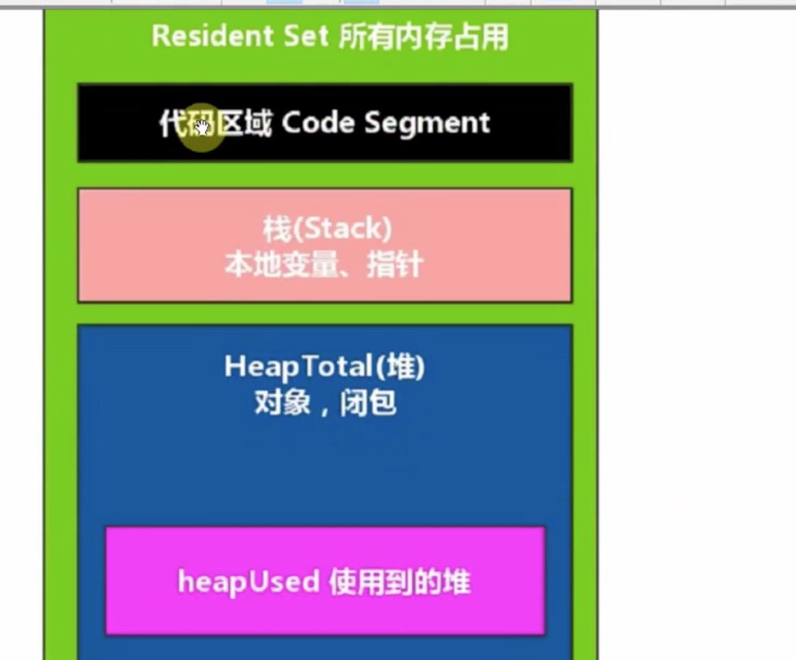
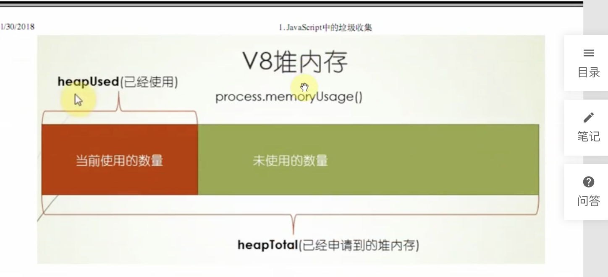
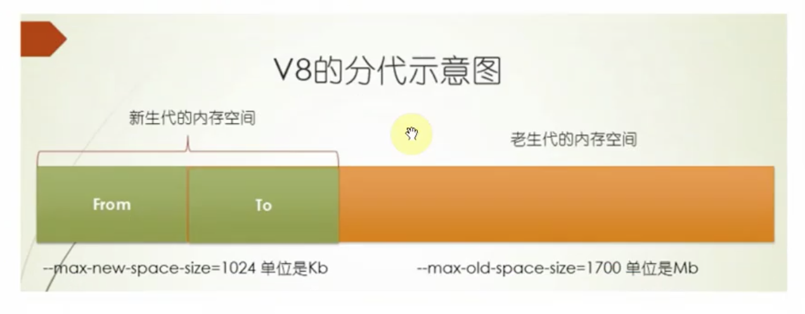

### 1 JavaScript中的垃圾收集
- 程序的运行需要内存，只要程序需要，操作系统就必须提供内存 [比如：你做一个排序，或者计算，就需要内容，就要找操作系统要]
- JavaScript使用自动内存管理，这被称为'垃圾回收机制'(garbage collector) [比如：你家二哈拆家，造成垃圾满地，你要去把垃圾收集好，扔掉]
- 优点是可以简化开发、节省代码
- 缺点是无法完整的掌握内存的分配与回收的具体过程 [就是说它对你来说是透明的，你根本察觉不到它，一旦出问题，也不好排查]

> C语言是要手动管理垃圾内容 手动释放的 [需要自己分配指针]

###### 1.1 NodeJS中的内存管理
- 网页端的内容泄露 [js跑在浏览器端的内存问题其实不是那么严重，因为浏览器是一个页面，泄露个几十K几百K对页面来说也没有什么太大影响。因为每个用户都会有一个独立的页面，和别人互不影响，即使泄露了，也只是影响一个人的]
- 对于持续运行的服务进程Node服务器端程序，必须及时释放不再用到的内存。否则，内存越来越高，轻则影响系统性能，重则导致进程崩溃 [node中对内存泄露很重要，如果不即使释放内存，内存会越来越大，如果内存被耗光了，系统就down掉了]
- 如果不再用到的内存没有及时释放，就叫做内存泄露 [一个垃圾，没有清楚掉它，它一直占用你的空间，就交内存泄露]

#### 1.2 V8内存管理
> 为什么限制? [是跟垃圾回收机制有关系的，啥关系？]
- 在64位操作系统中可以使用1.4G内存
- 在32为操作系统中可以使用0.7G内存

###### 1.2.2 V8内存管理
- JS对象都是通过V8进行分配管理内存的
- process.memoryUsage返回一个对象，包含了Node进程的内存占用信息 [参考：1.js]

-------------------------------------------------------

> 以下是根据图片详解
- Resident Set 所有内存占用 (这个进程所需要的内存都在绿色里)
- 代码区域 Code Segment    (代码区域 它也要占用内存)
- 栈(Stack) 本地变量、指针   (比如var a = {name: 'hasiqi'}) [a存在栈里面，它可以叫本地变量，或者指针，C语言里叫指针]
- HeapTotal(堆) 对象、闭包  (比如var a = {name: 'hasiqi'})  [{name: 'hasiqi'}在堆里，堆里又分为两项，对象或者函数闭包]
- heapUsed 使用到的堆 (粉色：实际使用的堆。比如申请100平的房子，实际住了10平方，用的时候一点点用，今天搬个冰箱，明天搬个洗衣机，一点点放，一点点用。判断内存泄露的时候要看它，如果它过大的话，就内存泄露了)

---------------------------------------------------------

---------------------------------------------------------

###### 1.2.3 为什么要限制内存大小
- 因为V8的垃圾收集工作原理导致的，1.4G内存完全一次垃圾收集需要1秒以上 [原因：内存越大，垃圾回收的时间越长，比如房子越大，打扫卫生的时间就越长]
- 这个暂停时间成为 Stop The Word, 在这个期间， 应用的性能和响应能力会下降 [原因：你执行垃圾回收的时候，整个程序会暂停，比如学校卫生间，阿姨打扫的时候，你不可以去上厕所，如果她打扫时间越长，你就得憋越长时间]

###### 1.2.4 如何打开内存限制 [啥意思？后面说？？？]
- 一旦初始化成功，生效后不能再修改
- max-new-space-size， 最大new space大小，执行scavenge回收， 默认16M，单位KB
- max-old-space-size, 最大old space大小， 执行MarkSweep回收， 默认1G， 单位MB

node --max-new-space-size=1024 app.js 单位是KB
node --max-old-space-size=2000 app.js 单位是M

### 2 V8的垃圾回收机制
- V8是基于分代的垃圾回收
- 不同垃圾回收机制也不一样
- 按存活的时间分为新生代和老生代

###### 2.1 分代
- 年龄小的是新声带，由From区域和To区域两个区域组成
  - 在64位操作系统里，新生代内存是32M，From区域和To区域各占用16M
  - 在32位系统里，新生代内存是16M，From区域和To区域各占8M

- 年龄大的是老生代，默认情况下
  - 64位操作系统下老生代内存是1400M
  - 32位操作系统下老生代内存是700M

---------------------------------------------------------

- from 从哪俩 [源]
- to 到哪去 [目标]

> 为什么要这么分？
`因为要满足我们垃圾回收的需要`
---------------------------------------------------------

###### 2.2 新生代垃圾回收
- 新生代区域一份为二，每个16M，一个使用，一个空闲
- 开始垃圾回收的时候，会检查FROM区域中的存活对象，如果还活着，拷贝到TO空间，完成后释放空间
- 完成后FROM和TO互换
- 新生代扫描的时候是一种广度优先的扫描策略
- 新生代的空间小，存活对象少
- 当一个对象经历过